# SQL Notes - Amjad Ali Kudsi

## Core

### Sample data

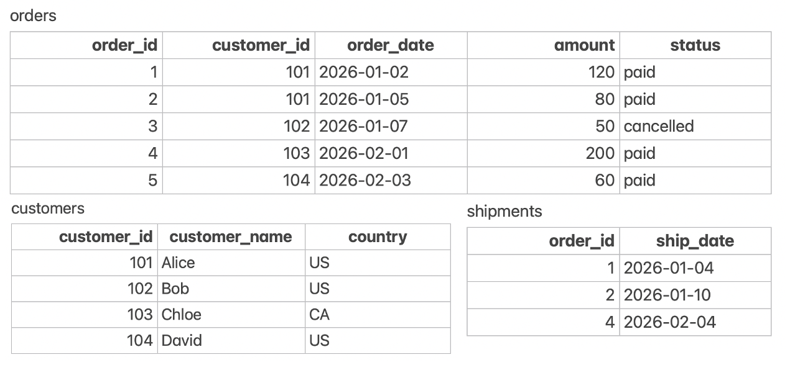

### Q) (Basic) Identify customers whose total spending on paid orders is at least 150, showing their total paid amount and ranking them from highest to lowest.

```sql
SELECT customer_id, SUM(amount) AS total_paid
FROM orders
WHERE status = 'paid'
GROUP BY customer_id
HAVING SUM(amount) >= 150
ORDER BY total_paid DESC, customer_id;
```

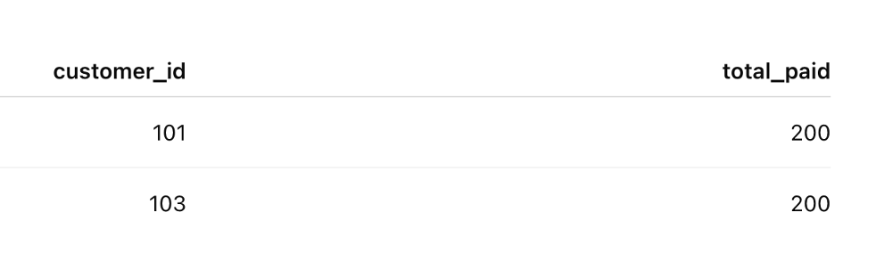

### Q) (Aggregate) Calculate the total number of paid orders and the average order amount.

```sql
SELECT COUNT(*) AS paid_orders, AVG(amount) AS avg_paid_amount
FROM orders
WHERE status = 'paid';
```


Other common aggregate functions and their purpose:

1. SUM(col): total of numeric values.
2. MIN(col): smallest value.
3. MAX(col): largest value.
4. COUNT(*): number of rows.
5. AVG(col): arithmetic mean.

### Q) (CASE) Classify each order as high, medium, or low based on its amount and list all orders in ascending order of order ID.

```sql
SELECT order_id, amount,
  CASE
    WHEN amount >= 150 THEN 'high'
    WHEN amount >= 80  THEN 'medium'
    ELSE 'low'
  END AS order_size
FROM orders
ORDER BY order_id;
```

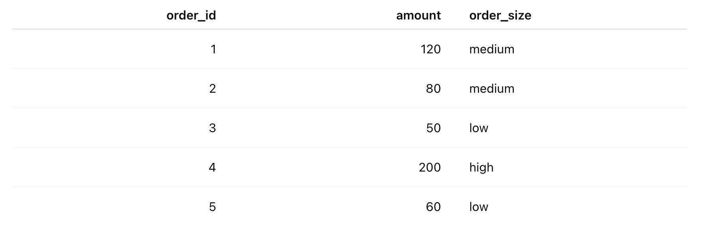

### Q) (Subquery) Retrieve orders whose amount is greater than the overall average order amount, listing them in ascending order of order ID.

```sql
SELECT order_id, amount
FROM orders
WHERE amount > (SELECT AVG(amount) FROM orders)
ORDER BY order_id;
```

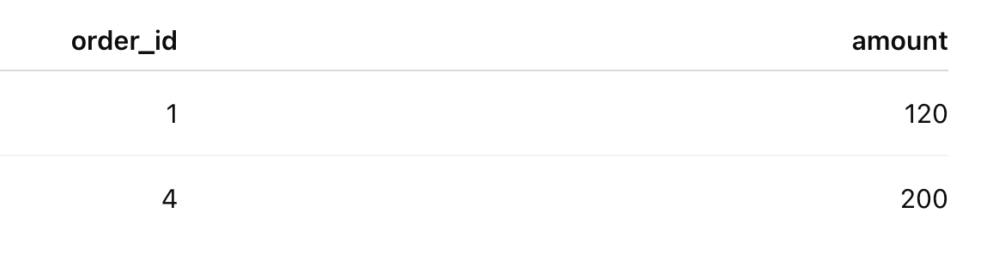

### Q) (UNION) List unique customer IDs that either belong to customers from the US or have placed at least one paid order, sorted by customer ID.

```sql
SELECT customer_id
FROM customers
WHERE country = 'US'
UNION
SELECT customer_id
FROM orders
WHERE status = 'paid'
ORDER BY customer_id;
```

Output: 101, 102, 103, 104
rows in either set

### Q) (INTERSECT) List customer IDs that belong to US customers who have also placed at least one paid order, sorted by customer ID.

```sql
SELECT customer_id
FROM customers
WHERE country = 'US'
INTERSECT
SELECT customer_id
FROM orders
WHERE status = 'paid'
ORDER BY customer_id;
```

Output: 101, 104
rows present in both sets

### Q) (EXCEPT) List customer IDs of US customers who have not placed any paid orders, sorted by customer ID.

```sql
SELECT customer_id
FROM customers
WHERE country = 'US'
EXCEPT
SELECT customer_id
FROM orders
WHERE status = 'paid'
ORDER BY customer_id;
```

Output: 102
rows in first set but not second

### Q) (DATE_TRUNC) Aggregate total order amounts by calendar month using the order date, and display the results in chronological order.

```sql
SELECT DATE_TRUNC('month', order_date) AS month_start, SUM(amount) AS total_amount
FROM orders
GROUP BY 1
ORDER BY 1;
```

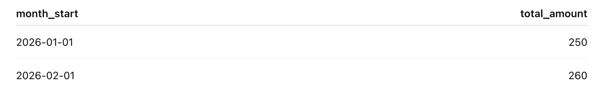

truncates date or timestamp to a chosen grain such as month

### Q) (DATEDIFF) Calculate the number of days taken to ship each order by comparing order date and ship date, and list the results by order ID.

```sql
SELECT o.order_id, o.order_date, s.ship_date,
  DATEDIFF('day', o.order_date, s.ship_date) AS days_to_ship
FROM orders o
JOIN shipments s
  ON o.order_id = s.order_id
ORDER BY o.order_id;
```

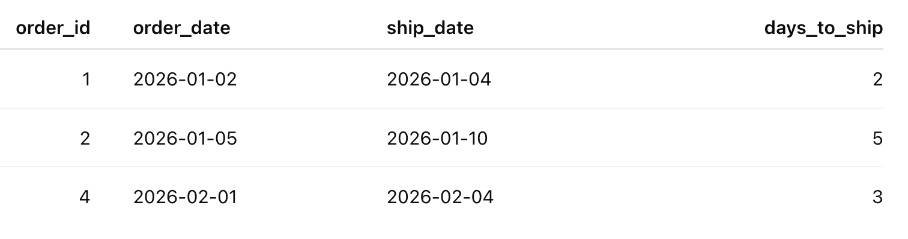

returns the difference expr2 - expr1 in the chosen unit.

---

## Joins

### Sample data

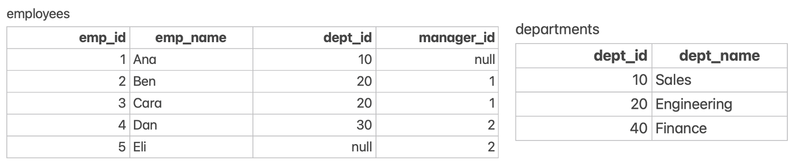

### Q) (JOIN) Retrieve each employee's ID and name along with their department name and display the results sorted by employee ID.

```sql
SELECT e.emp_id, e.emp_name, d.dept_name
FROM employees e
JOIN departments d
  ON e.dept_id = d.dept_id
ORDER BY e.emp_id;
```

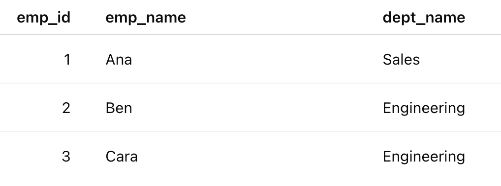

only matched rows survive.

### Q) (INNER JOIN) Retrieve each employee's ID and name along with their department name, returning only employees that belong to a valid department and ordering the results by employee ID.

```sql
SELECT e.emp_id, e.emp_name, d.dept_name
FROM employees e
INNER JOIN departments d
  ON e.dept_id = d.dept_id
ORDER BY e.emp_id;
```

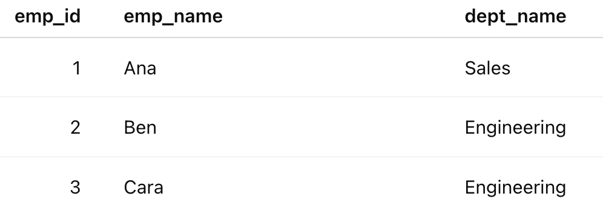

explicit version of default JOIN.

### Q) (LEFT JOIN) Retrieve all employees with their ID and name and include the department name when available, ordered by employee ID.

```sql
SELECT e.emp_id, e.emp_name, d.dept_name
FROM employees e
LEFT JOIN departments d
  ON e.dept_id = d.dept_id
ORDER BY e.emp_id;
```

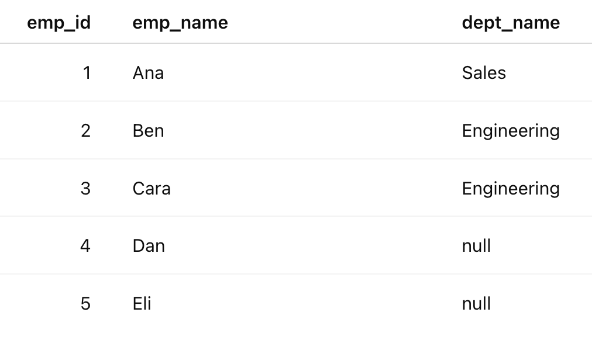

keep all left table rows, fill right side with null when no match.

### Q) (RIGHT JOIN) Retrieve all department IDs and include employee IDs and names where available, ordered by department ID and then employee ID.

```sql
SELECT e.emp_id, e.emp_name, d.dept_id
FROM employees e
RIGHT JOIN departments d
  ON e.dept_id = d.dept_id
ORDER BY d.dept_id, e.emp_id;
```

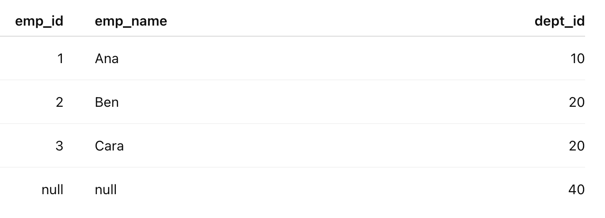

keep all right table rows, fill left side with null when no match.

### Q) (FULL OUTER JOIN) Display all employees and all departments together so that rows appear even when there is no matching department or no matching employee, and sort the output to place departments without employees after employees by ordering null employee IDs last.

```sql
SELECT e.emp_id, e.emp_name, d.dept_name
FROM employees e
FULL OUTER JOIN departments d
  ON e.dept_id = d.dept_id
ORDER BY
  CASE WHEN e.emp_id IS NULL THEN 1 ELSE 0 END,
  e.emp_id;
```

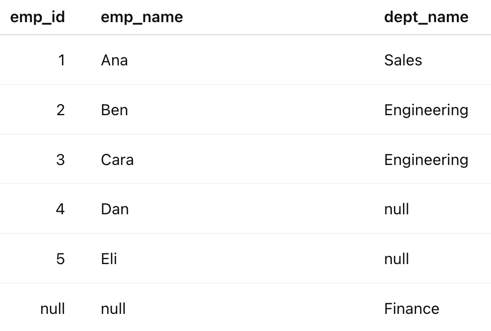

keep everything from both sides.
0 is assigned to rows where e.emp_id is **not null**, 1 is assigned to rows where e.emp_id **is null**
When sorting in ascending order, SQL places 0 before 1, so: Rows with employees appear first.

*Note: There is no difference between LEFT JOIN and LEFT OUTER JOIN in SQL. The OUTER keyword is optional and both commands return the exact same result. Some developers may choose to include the OUTER keyword for explicit clarity to distinguish it from an INNER JOIN, but it does not affect the query's execution or performance.*

### Q) (CROSS JOIN) (helper table used) Generate all possible combinations of departments and work modes so that each department is paired with every available work mode, and display the results ordered by department name and mode.

Create one tiny helper table first:
```
work_modes table :
mode
- Remote
- Office
```

```sql
SELECT d.dept_name, w.mode
FROM departments d
CROSS JOIN work_modes w
ORDER BY d.dept_name, w.mode;
```

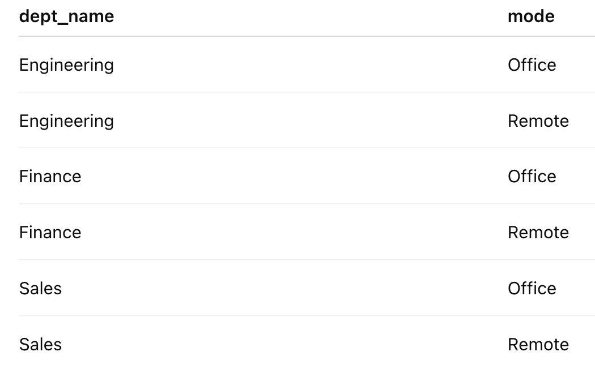

all combinations. If one table has N rows and the other has M rows, result has N * M rows.

### Q) (SELF JOIN) Display each employee's name along with their manager's name, ensuring employees without a manager are still included and ordering the results by employee ID.

```sql
SELECT
  e.emp_name AS employee,
  m.emp_name AS manager
FROM employees e
LEFT JOIN employees m
  ON e.manager_id = m.emp_id
ORDER BY e.emp_id;
```

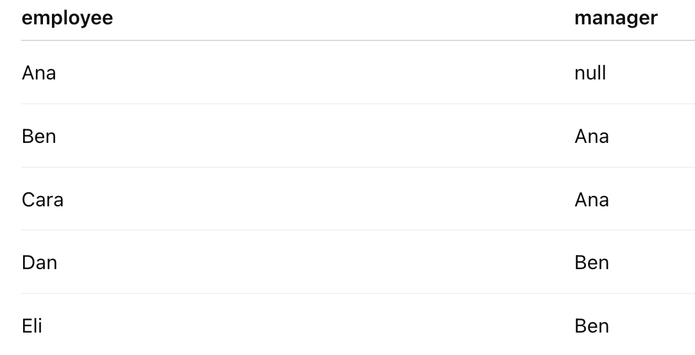

compare rows within the same table.

---

## CTEs (Common Table Expressions)

Are a way to give a name to a temporary query result and reuse it within a single SQL statement.

Defined using the 'WITH' keyword.

Acts like a temporary table that exists only for the duration of the query
Helps break complex queries into smaller, readable parts.
Can be referenced by name in SELECT, INSERT, UPDATE, or DELETE statements

Types:
**Multi-CTE query**: several CTE blocks chained to break a complex query into readable steps.
**Recursive CTE**: a CTE that references itself to walk hierarchies or iterative paths.
**CTE readability pattern**: use CTEs to separate cleaning, joining, and final aggregation steps.

### Sample data

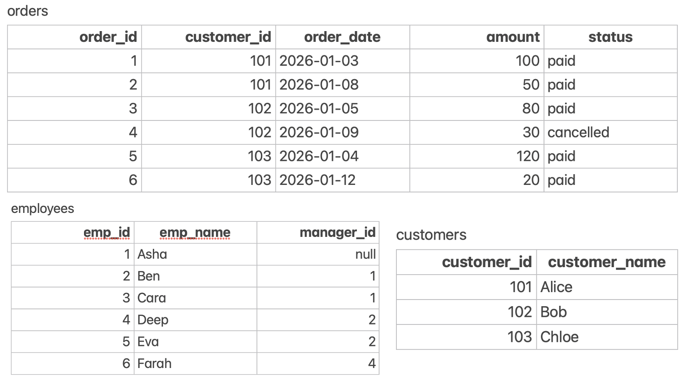

### Q) (CTE) Calculate the total amount paid by each customer using only paid orders, then return customers whose total paid amount is at least 100, sorted from highest to lowest total.

```sql
WITH customer_paid_totals AS (
  SELECT
    customer_id,
    SUM(amount) AS total_paid
  FROM orders
  WHERE status = 'paid'
  GROUP BY customer_id
)
SELECT
  customer_id,
  total_paid
FROM customer_paid_totals
WHERE total_paid >= 100
ORDER BY total_paid DESC;
```

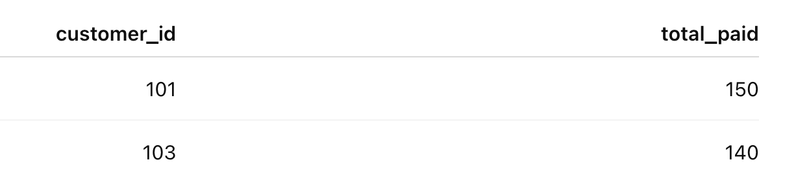

Name an intermediate result once, then query it.

### Q) (Multi-CTE query) For each customer with at least one paid order, return the customer name, the total number of paid orders, and the date of their first paid order, sorted alphabetically by customer name.

```sql
WITH paid_orders AS (
  SELECT customer_id, order_date, amount
  FROM orders
  WHERE status = 'paid'),
order_counts AS (
  SELECT customer_id, COUNT(*) AS paid_order_count
  FROM paid_orders
  GROUP BY customer_id),
first_paid_order AS (
  SELECT customer_id, MIN(order_date) AS first_paid_date
  FROM paid_orders
  GROUP BY customer_id)
SELECT c.customer_name, oc.paid_order_count, fpo.first_paid_date
FROM customers c JOIN order_counts oc ON c.customer_id = oc.customer_id
JOIN first_paid_order fpo ON c.customer_id = fpo.customer_id
ORDER BY c.customer_name;
```

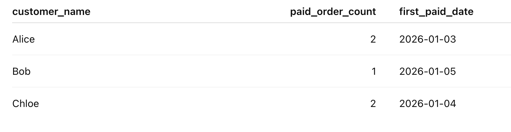

Break a bigger problem into clean, testable steps.

### Q) (Recursive CTE) Generate the full employee reporting hierarchy by recursively traversing manager relationships, assigning each employee a level based on their distance from the top level manager, and ordering the results by hierarchy level and employee ID.

```sql
WITH RECURSIVE org AS (
  -- Anchor row: top manager(s)
  SELECT emp_id, emp_name, manager_id, 0 AS level
  FROM employees
  WHERE manager_id IS NULL

  UNION ALL

  -- Recursive step: find direct reports of current level
  SELECT e.emp_id, e.emp_name, e.manager_id, o.level + 1 AS level
  FROM employees e
  JOIN org o
    ON e.manager_id = o.emp_id
)
SELECT emp_id, emp_name, manager_id, level
FROM org
ORDER BY level, emp_id;
```


Traverse hierarchical data when depth is unknown in advance, like org charts.

### Q) (CTE readability pattern) Filter to valid paid orders (paid status and positive amount), compute per customer paid order count, total paid, and average paid order value, then output these metrics with customer names sorted by highest total paid.

```sql
WITH source_orders AS (
  SELECT order_id, customer_id, order_date, amount, status
  FROM orders),
clean_paid_orders AS (
  SELECT order_id, customer_id, order_date, amount
  FROM source_orders
  WHERE status = 'paid'
  AND amount > 0),
customer_metrics AS (
  SELECT customer_id, COUNT(*) AS paid_order_count,
    SUM(amount) AS total_paid,
    AVG(amount) AS avg_paid
  FROM clean_paid_orders
  GROUP BY customer_id),
final AS (
  SELECT c.customer_name, m.paid_order_count, m.total_paid, m.avg_paid
  FROM customer_metrics m
  JOIN customers c
    ON m.customer_id = c.customer_id)
SELECT *
FROM final
ORDER BY total_paid DESC;
```

**Purpose:** Use CTEs as logical blocks: source -> clean -> business logic -> final.
This is a style pattern for maintainability, not a separate SQL keyword. Snowflake docs note CTEs improve modularity and maintenance, and dbt style guidance emphasizes clear structure and explicitness.

---

## Window functions

computes a value across related rows while keeping one output row per input row.

### Sample data

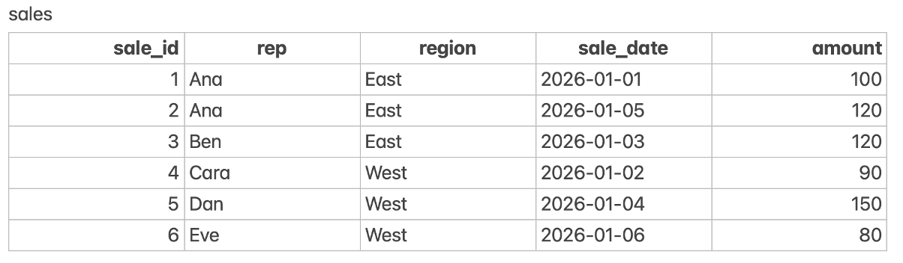

### Q) (PARTITION BY) What is each sale's amount along with the total sales amount for its region, shown for every sale?

```sql
SELECT sale_id, region, amount, SUM(amount) OVER (PARTITION BY region) AS region_total
FROM sales
ORDER BY region, sale_id;
```

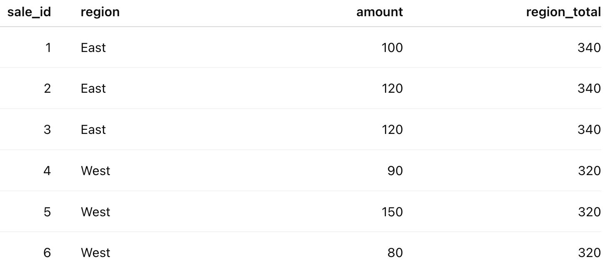

creates separate windows per region.

### Q) (ORDER BY) What is the sequential order of each sale within its region when sales are ordered by sale date?

```sql
SELECT region, rep, sale_date,
  ROW_NUMBER() OVER (
    PARTITION BY region
    ORDER BY sale_date
  ) AS seq_in_region
FROM sales
ORDER BY region, sale_date, rep;
```

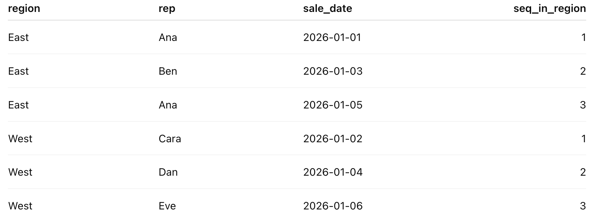

window ORDER BY controls sequence inside each partition, and it is separate from the final query ORDER BY

### Q) (Window frame) What is the two row moving sum of sales amounts within each region when ordered by sale date?

```sql
SELECT region, sale_date, amount,
  SUM(amount) OVER (
    PARTITION BY region
    ORDER BY sale_date
    ROWS BETWEEN 1 PRECEDING AND CURRENT ROW
  ) AS moving_2_row_sum
FROM sales
ORDER BY region, sale_date;
```

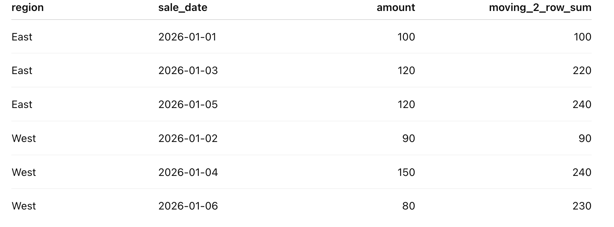

the frame ROWS BETWEEN 1 PRECEDING AND CURRENT ROW means current row plus previous row only.
Snowflake requires window ORDER BY when frame syntax is used.

### Q) (ROW_NUMBER) What is the ranking of each sale for every sales representative when their sales are ordered from most recent to oldest?

```sql
SELECT rep, sale_date, amount,
  ROW_NUMBER() OVER (
    PARTITION BY rep
    ORDER BY sale_date DESC
  ) AS rn_latest_first
FROM sales
ORDER BY rep, rn_latest_first;
```

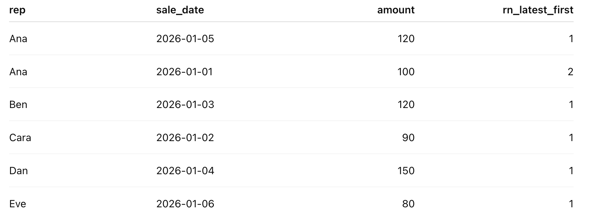

ROW_NUMBER gives unique sequential numbers inside each partition.

### Q) (RANK) What is the rank of each sales representative's sale amount within their region when amounts are ordered from highest to lowest?

```sql
SELECT region, rep, amount,
  RANK() OVER (
    PARTITION BY region
    ORDER BY amount DESC
  ) AS rnk
FROM sales
ORDER BY region, rnk, rep;
```

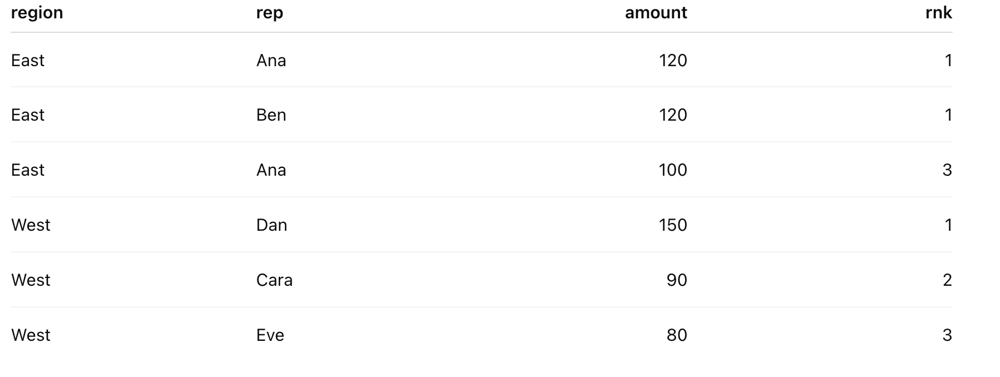

ties share the same rank, and gaps appear after ties.

### Q) (DENSE_RANK) What is the dense rank of each sales representative's sale amount within their region when amounts are ordered from highest to lowest?

```sql
SELECT region, rep, amount,
  DENSE_RANK() OVER (
    PARTITION BY region
    ORDER BY amount DESC
  ) AS dense_rnk
FROM sales
ORDER BY region, dense_rnk, rep;
```

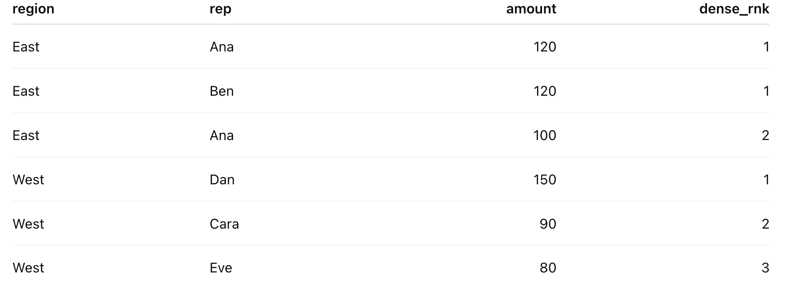

ties share rank, but no gaps in rank numbers.

### Q) (LAG and LEAD) What are the previous and next sale amounts for each sale within the same region when sales are ordered by date?

```sql
SELECT region, sale_date, amount,
  LAG(amount) OVER (
    PARTITION BY region
    ORDER BY sale_date
  ) AS prev_amount,
  LEAD(amount) OVER (
    PARTITION BY region
    ORDER BY sale_date
  ) AS next_amount
FROM sales
ORDER BY region, sale_date;
```

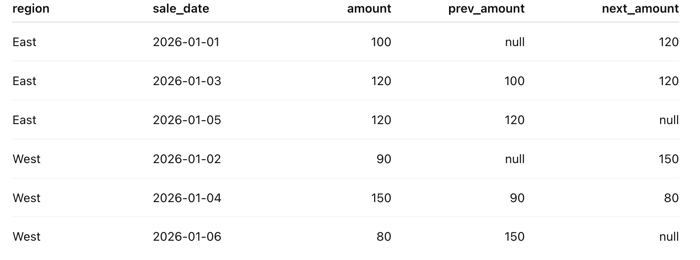

LAG reads prior row value and LEAD reads next row value, based on window ordering.

### Q) (Running total) What is the running total of sales amounts within each region when ordered by sale date?

```sql
SELECT region, sale_date, amount,
  SUM(amount) OVER (
    PARTITION BY region
    ORDER BY sale_date
    ROWS BETWEEN UNBOUNDED PRECEDING AND CURRENT ROW
  ) AS running_total
FROM sales
ORDER BY region, sale_date;
```

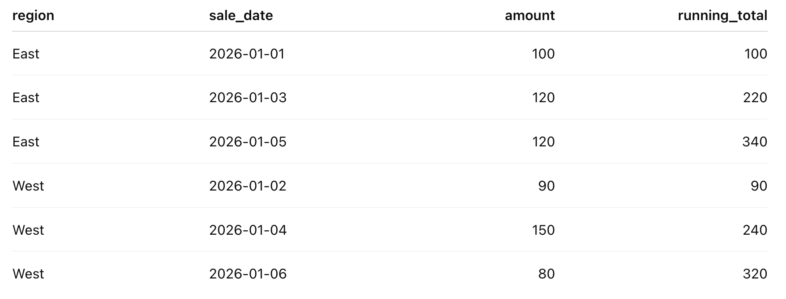

cumulative sum inside each partition in date order. PostgreSQL docs describe this as running sum behavior with aggregate window functions and ordering.

### Q) (QUALIFY (Snowflake)) Which sale is the top sale in each region based on the highest amount, using the most recent sale date to break ties?

```sql
SELECT region, rep, amount, sale_date
FROM sales
QUALIFY ROW_NUMBER() OVER (
  PARTITION BY region
  ORDER BY amount DESC, sale_date DESC
) = 1
ORDER BY region;
```

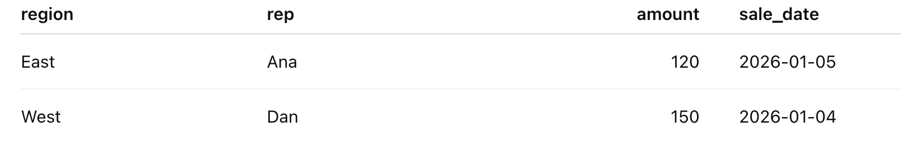

QUALIFY filters by a window function result without wrapping in a subquery. Snowflake docs explicitly describe this pattern. Also, QUALIFY is Snowflake specific and not ANSI standard.

---

## Cohort and funnel logic

A cohort is a group of users who share a common characteristic, often acquisition date, and cohort analysis tracks how these groups behave over time.

A funnel is a sequence of ordered events, and funnel analysis measures how users succeed or fail at each step.

Time to convert is the time users take to move through funnel steps.

### Sample data: `user_events`

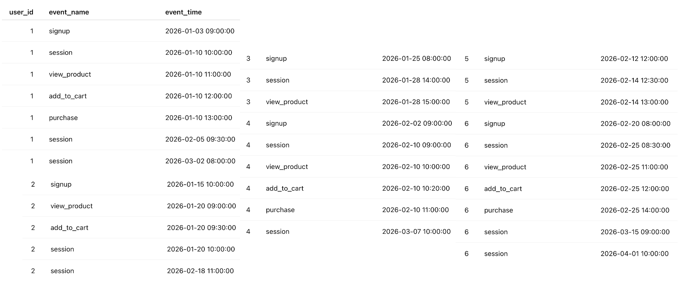

### Q) (Cohort) assign each user to a cohort based on first signup month.

```sql
SELECT user_id, DATE_TRUNC('month', MIN(event_time)) AS cohort_month
FROM events
WHERE event_name = 'signup'
GROUP BY user_id
ORDER BY user_id;
```

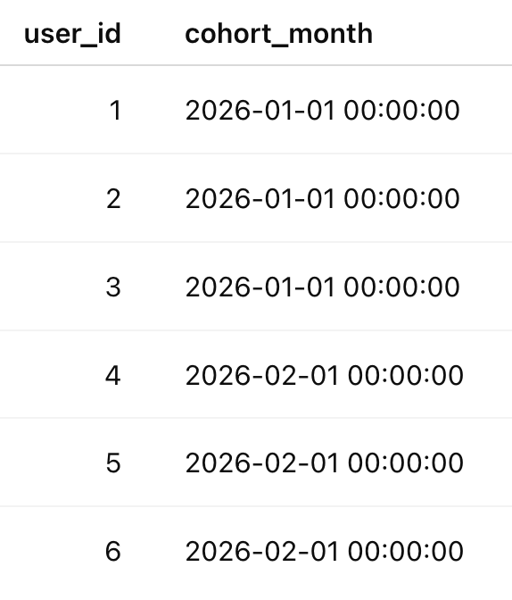

### Q) (Cohort analysis) for each cohort month, count how many users were active in month 0, month 1, month 2, etc.

```sql
WITH cohort AS (
  SELECT user_id, DATE_TRUNC('month', MIN(event_time)) AS cohort_month
  FROM events
  WHERE event_name = 'signup'
  GROUP BY user_id ),
activity AS (
  SELECT DISTINCT user_id, DATE_TRUNC('month', event_time) AS activity_month
  FROM events
  WHERE event_name IN ('session', 'purchase') )
SELECT c.cohort_month, DATEDIFF('month', c.cohort_month, a.activity_month) AS month_number,
  COUNT(DISTINCT c.user_id) AS retained_users
FROM cohort c
JOIN activity a
  ON c.user_id = a.user_id
WHERE DATEDIFF('month', c.cohort_month, a.activity_month) BETWEEN 0 AND 2
GROUP BY 1, 2
ORDER BY 1, 2;
```

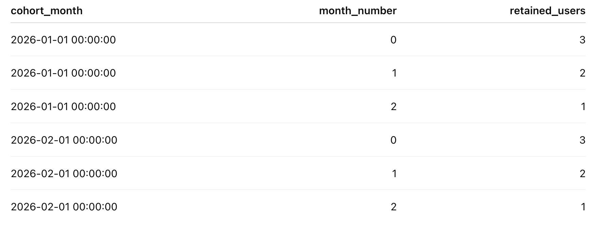

### Q) (Cohort retention table) pivot cohort analysis into a retention matrix with percentages per cohort.

```sql
WITH cohort AS (
  SELECT user_id, DATE_TRUNC('month', MIN(event_time)) AS cohort_month
  FROM events
  WHERE event_name = 'signup'
  GROUP BY user_id ),
activity AS (
  SELECT DISTINCT user_id, DATE_TRUNC('month', event_time) AS activity_month
  FROM events
  WHERE event_name IN ('session', 'purchase') ),
retention AS (
  SELECT c.cohort_month, DATEDIFF('month', c.cohort_month, a.activity_month) AS month_number,
    COUNT(DISTINCT c.user_id) AS retained_users
  FROM cohort c
  JOIN activity a
    ON c.user_id = a.user_id
  WHERE DATEDIFF('month', c.cohort_month, a.activity_month) BETWEEN 0 AND 2
  GROUP BY 1, 2 ),
cohort_size AS (
  SELECT cohort_month, COUNT(*) AS cohort_users
  FROM cohort
  GROUP BY 1 )
SELECT cs.cohort_month, cs.cohort_users,
  ROUND(100.0 * COALESCE(MAX(CASE WHEN r.month_number = 0 THEN r.retained_users END), 0) / cs.cohort_users, 1) AS m0_retention_pct,
  ROUND(100.0 * COALESCE(MAX(CASE WHEN r.month_number = 1 THEN r.retained_users END), 0) / cs.cohort_users, 1) AS m1_retention_pct,
  ROUND(100.0 * COALESCE(MAX(CASE WHEN r.month_number = 2 THEN r.retained_users END), 0) / cs.cohort_users, 1) AS m2_retention_pct
FROM cohort_size cs
LEFT JOIN retention r
  ON cs.cohort_month = r.cohort_month
GROUP BY cs.cohort_month, cs.cohort_users
ORDER BY cs.cohort_month;
```

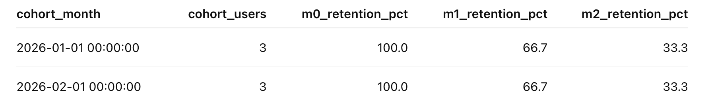

### Q) (Funnel) count users who reach each step in order: view_product -> add_to_cart -> purchase.

```sql
WITH step1 AS (
  SELECT user_id, MIN(event_time) AS t1
  FROM events
  WHERE event_name = 'view_product'
  GROUP BY user_id ),
step2 AS (
  SELECT e.user_id, MIN(e.event_time) AS t2
  FROM events e
  JOIN step1 s1
    ON e.user_id = s1.user_id
  WHERE e.event_name = 'add_to_cart'
  AND e.event_time >= s1.t1
  GROUP BY e.user_id ),
step3 AS (
  SELECT e.user_id, MIN(e.event_time) AS t3
  FROM events e
  JOIN step2 s2
    ON e.user_id = s2.user_id
  WHERE e.event_name = 'purchase'
  AND e.event_time >= s2.t2
  GROUP BY e.user_id )
SELECT 1 AS step_order, 'view_product' AS step_name, COUNT(*) AS users
FROM step1
UNION ALL
SELECT 2, 'add_to_cart', COUNT(*) FROM step2
UNION ALL
SELECT 3, 'purchase', COUNT(*) FROM step3
ORDER BY step_order;
```

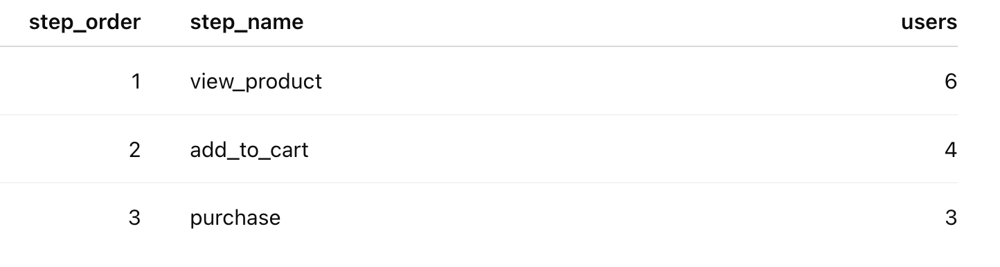

### Q) (Step conversion rate) compute transition conversion rates between consecutive funnel steps.

```sql
WITH step1 AS (
  SELECT user_id, MIN(event_time) AS t1
  FROM events
  WHERE event_name = 'view_product'
  GROUP BY user_id ),
step2 AS (
  SELECT e.user_id, MIN(e.event_time) AS t2
  FROM events e
  JOIN step1 s1 ON e.user_id = s1.user_id
  WHERE e.event_name = 'add_to_cart'
  AND e.event_time >= s1.t1
  GROUP BY e.user_id ),
step3 AS (
  SELECT e.user_id, MIN(e.event_time) AS t3
  FROM events e
  JOIN step2 s2 ON e.user_id = s2.user_id
  WHERE e.event_name = 'purchase'
  AND e.event_time >= s2.t2
  GROUP BY e.user_id ),
counts AS (
  SELECT
    (SELECT COUNT(*) FROM step1) AS step1_users,
    (SELECT COUNT(*) FROM step2) AS step2_users,
    (SELECT COUNT(*) FROM step3) AS step3_users
)
SELECT step1_users, step2_users, step3_users,
  ROUND(100.0 * step2_users / NULLIF(step1_users, 0), 2) AS step1_to_step2_conversion_pct,
  ROUND(100.0 * step3_users / NULLIF(step2_users, 0), 2) AS step2_to_step3_conversion_pct,
  ROUND(100.0 * step3_users / NULLIF(step1_users, 0), 2) AS overall_funnel_conversion_pct
FROM counts;
```

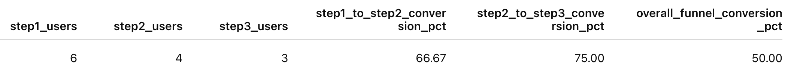

### Q) (Drop-off rate) compute users lost and percentage lost between steps.

```sql
WITH step1 AS (
  SELECT user_id, MIN(event_time) AS t1
  FROM events
  WHERE event_name = 'view_product'
  GROUP BY user_id ),
step2 AS (
  SELECT e.user_id, MIN(e.event_time) AS t2
  FROM events e
  JOIN step1 s1 ON e.user_id = s1.user_id
  WHERE e.event_name = 'add_to_cart'
  AND e.event_time >= s1.t1
  GROUP BY e.user_id ),
step3 AS (
  SELECT e.user_id, MIN(e.event_time) AS t3
  FROM events e
  JOIN step2 s2 ON e.user_id = s2.user_id
  WHERE e.event_name = 'purchase'
  AND e.event_time >= s2.t2
  GROUP BY e.user_id ),
counts AS (
  SELECT
    (SELECT COUNT(*) FROM step1) AS step1_users,
    (SELECT COUNT(*) FROM step2) AS step2_users,
    (SELECT COUNT(*) FROM step3) AS step3_users )
SELECT 'view_product -> add_to_cart' AS transition,
  step1_users - step2_users AS dropped_users,
  ROUND(100.0 * (step1_users - step2_users) / NULLIF(step1_users, 0), 2) AS dropoff_pct
FROM counts
UNION ALL
SELECT 'add_to_cart -> purchase', step2_users - step3_users,
  ROUND(100.0 * (step2_users - step3_users) / NULLIF(step2_users, 0), 2)
FROM counts;
```

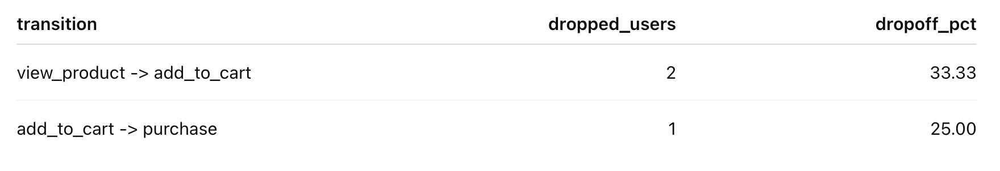

### Q) (Time-to-convert) measure how long converted users take from first step to final step.

```sql
WITH first_view AS (
  SELECT user_id, MIN(event_time) AS view_time
  FROM events
  WHERE event_name = 'view_product'
  GROUP BY user_id ),
first_purchase_after_view AS (
  SELECT e.user_id, MIN(e.event_time) AS purchase_time
  FROM events e
  JOIN first_view v
    ON e.user_id = v.user_id
  WHERE e.event_name = 'purchase'
  AND e.event_time >= v.view_time
  GROUP BY e.user_id ),
per_user AS (
  SELECT v.user_id, DATEDIFF('minute', v.view_time, p.purchase_time) AS minutes_to_convert
  FROM first_view v
  JOIN first_purchase_after_view p
    ON v.user_id = p.user_id )
SELECT user_id, minutes_to_convert,
  AVG(minutes_to_convert) OVER () AS avg_minutes_to_convert,
  MEDIAN(minutes_to_convert) OVER () AS median_minutes_to_convert
FROM per_user
ORDER BY user_id;
```

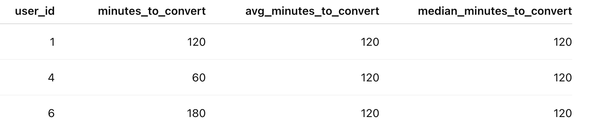

---

## Data quality checks in SQL

**Mental model:**
- Every query below is a data quality test query.
- If the query returns **zero rows**, the test passes.
- If it returns **one or more rows**, those rows are the failures.

** That pattern is exactly how SQL based data tests are commonly defined in dbt.

```
dataset:
customers(customer_id, email, customer_status, created_at)
orders(order_id, customer_id, order_status, order_total, order_date, loaded_at)
expected_daily_order_counts(metric_date, expected_count)
```

(syntax below uses Snowflake DATEDIFF and CURRENT_TIMESTAMP)

### Q) (Data test (custom test)) show the general pattern, write a query that returns rows that violate your rule.

Example rule: no orders should have future dates.

```sql
SELECT order_id, order_date
FROM orders
WHERE order_date > CURRENT_DATE;
```

Pass condition: returns 0 rows
This is a singular custom test pattern.

### Q) (Not null check) required column must not be null.

```sql
SELECT order_id
FROM orders
WHERE customer_id IS NULL;
```

Pass condition: returns 0 rows
not_null is one of the built in generic tests.

### Q) (Unique check) key column should not contain duplicates.

```sql
SELECT order_id, COUNT(*) AS cnt
FROM orders
GROUP BY order_id
HAVING COUNT(*) > 1;
```

Pass condition: returns 0 rows
unique validates no duplicate values in the field.

### Q) (Relationship check) every child key should map to a parent key.

```sql
SELECT o.order_id, o.customer_id
FROM orders o
LEFT JOIN customers c
  ON o.customer_id = c.customer_id
WHERE o.customer_id IS NOT NULL
  AND c.customer_id IS NULL;
```

Pass condition: returns 0 rows
This checks referential integrity between child and parent tables.

### Q) (Accepted values check) categorical column should contain only allowed values.

```sql
SELECT order_id, order_status
FROM orders
WHERE order_status IS NOT NULL
  AND order_status NOT IN ('placed', 'shipped', 'completed', 'returned');
```

Pass condition: returns 0 rows
accepted_values checks non null values against a supplied allowed list.

### Q) (Freshness check) fail if latest loaded record is older than SLA, here 24 hours.

```sql
WITH last_load AS (
  SELECT MAX(loaded_at) AS max_loaded_at
  FROM orders
)
SELECT max_loaded_at, DATEDIFF('hour', max_loaded_at, CURRENT_TIMESTAMP()) AS hours_since_load
FROM last_load
WHERE DATEDIFF('hour', max_loaded_at, CURRENT_TIMESTAMP()) > 24;
```

Pass condition: returns 0 rows
This matches freshness logic, compare most recent loaded timestamp to now and enforce threshold.

### Q) (Row count reconciliation) actual row count should match expected row count for the day.

```sql
WITH actual AS (
  SELECT COUNT(*) AS actual_count
  FROM orders
  WHERE CAST(order_date AS DATE) = CURRENT_DATE ),
expected AS (
  SELECT expected_count
  FROM expected_daily_order_counts
  WHERE metric_date = CURRENT_DATE )
SELECT a.actual_count, e.expected_count, (a.actual_count - e.expected_count) AS diff
FROM actual a
JOIN expected e
  ON 1 = 1
WHERE a.actual_count <> e.expected_count;
```

Pass condition: returns 0 rows

### Q) (Business rule validation) enforce a domain rule, here completed orders must have positive amount.

```sql
SELECT order_id, order_status, order_total
FROM orders
WHERE order_status = 'completed'
  AND (order_total IS NULL OR order_total <= 0);
```

Pass condition: returns 0 rows
This is a custom assertion style test, same failing rows pattern.

---

## Query debugging and performance basics

**EXPLAIN plan:** shows how SQL engine scans tables and performs joins.
You use EXPLAIN before guessing. You read scans, joins, filters, and row estimates, then validate with actual runtime metrics

In Snowflake, EXPLAIN returns a logical plan and does not execute the query.
It includes operations, expressions, and partition estimates such as partitionsAssigned and bytesAssigned.
For executed queries, Snowflake Query Profile in Query History is where you inspect real bottlenecks. Query History in Snowsight shows recent history up to 14 days.
In PostgreSQL, EXPLAIN shows estimated costs and chosen scan and join methods, while EXPLAIN ANALYZE actually runs the query and reports actual timings and row counts.

"I start with EXPLAIN to see planned scan and join shape. Then I validate with actual profile metrics and compare expected versus actual row volume to find misestimates or expensive operators."

**Mini checklist**
- Identify largest scan node
- Check join type and join order
- Compare estimated rows versus actual rows
- Check spilled work and skew if platform exposes it
- Re test after one focused change, not five changes at once

**Cost based tuning:** improves performance by reducing expensive scans, joins, and sorts.
You understand optimizer economics. You reduce work early and keep planner inputs reliable.

Cost based planners compare alternative plans and pick the lowest estimated cost path.
In Postgres, startup cost and total cost are explicit and are planner estimates in arbitrary cost units.
Planner quality depends on stats.
In Postgres, ANALYZE collects table stats that the planner uses for plan choice.

"My first lever is reducing data scanned and rows carried into joins. Then I use plan evidence to decide whether the bottleneck is scan volume, join strategy, or aggregation shape."

**Practical tuning mindset**
- Reduce scanned data first, then tune compute
- Push selective filters early
- Avoid unnecessary wide selects
- Pre aggregate before huge joins when possible
- Ensure join keys and filter keys are typed consistently
- Refresh stats where your engine requires it

**Predicate pushdown mindset:** filter early to shrink data before joins and windows.
You write SQL so filtering happens as early as possible.

Snowflake defines pushdown as filtering unneeded rows as early as possible, which improves performance and can reduce memory usage.
Snowflake micro partition metadata enables pruning, so selective predicates can skip many micro partitions at runtime.

"I write filters so the engine can prune early. My goal is fewer partitions scanned before joins or aggregation."

Good pattern: Use range filters that preserve pruning opportunities.

Example pattern:
```sql
-- Less ideal:
WHERE DATE(order_ts) = '2026-01-15'

-- Better:
WHERE order_ts >= '2026-01-15' AND order_ts < '2026-01-16'
```

**Index and clustering awareness:** know how physical layout affects query speed.
You know platform differences and choose the right physical optimization for each.

For row store systems like Postgres, indexes can speed up WHERE and JOIN predicates, including joins on indexed join keys.
In Snowflake, clustering keys help co locate related data in micro partitions and improve scan efficiency by skipping non matching data, especially for very large tables.
Automatic Clustering exists and can trigger credit consumption, so it should be applied deliberately.
Snowflake Search Optimization can accelerate selective lookups and some join patterns, and best practice is often enabling on specific columns instead of everything.

"I do not blindly add clustering or search optimization. I confirm query pattern first, estimate benefit, then apply targeted optimization and measure before and after."

**If they ask, "How do you debug a slow query?"**
1. Reproduce and baseline with query history and profile metrics.
2. Run EXPLAIN to inspect logical plan and expected scan and join path.
3. Identify the dominant operator, usually scan or join.
4. Apply one change, usually early filter, join reshaping, or data layout optimization.
5. Re run and compare measurable deltas.

---

## Top Important variants

SQL is standardized as ISO/IEC 9075.

Then the most important production dialect families, if you prioritize by broad developer usage and enterprise presence, start with:

1. PostgreSQL SQL dialect (plus PL/pgSQL for procedural code)
2. MySQL dialect, with its own stored routine syntax (BEGIN ... END, CREATE PROCEDURE)
3. Microsoft T-SQL - SQL Server, Azure SQL
4. Oracle SQL (plus PL/SQL for procedural code)
5. SQLite SQL dialect, with dynamic typing behavior that is very different from server databases.

Important cloud warehouse dialects:

1. GoogleSQL (BigQuery)
2. Snowflake SQL
3. Redshift SQL

These are SQL dialects with platform specific features and syntax differences.

If you write only basic SELECT, INSERT, UPDATE, DELETE, JOIN, GROUP BY, most syntax feels similar.

The big differences appear in:

1. UPSERT
2. Pagination
3. Stored procedures and functions
4. Identifier case and quoting
5. Type behavior
6. Transaction defaults

So yes, there are major syntax differences in real work.

Examples for "Same task, different syntax":

Assume table users(id, name).

### A) UPSERT

**PostgreSQL:** (INSERT ... ON CONFLICT)
```sql
INSERT INTO users (id, name)
VALUES (1, 'Ana')
ON CONFLICT (id) DO UPDATE
SET name = EXCLUDED.name;
```

**MySQL:** (ON DUPLICATE KEY UPDATE in INSERT)
```sql
INSERT INTO users (id, name)
VALUES (1, 'Ana')
ON DUPLICATE KEY UPDATE
name = VALUES(name);
```

**SQL Server:** (MERGE)
```sql
MERGE INTO users AS t
USING (VALUES (1, 'Ana')) AS s(id, name)
ON t.id = s.id
WHEN MATCHED THEN UPDATE SET name = s.name
WHEN NOT MATCHED THEN INSERT (id, name) VALUES (s.id, s.name);
```

**Oracle:** (MERGE)
```sql
MERGE INTO users t
USING (SELECT 1 AS id, 'Ana' AS name FROM dual) s
ON (t.id = s.id)
WHEN MATCHED THEN UPDATE SET t.name = s.name
WHEN NOT MATCHED THEN INSERT (id, name) VALUES (s.id, s.name);
```

**Note: PostgreSQL now has MERGE too.

### B) Pagination

**PostgreSQL:**
```sql
SELECT * FROM users
ORDER BY id
LIMIT 10 OFFSET 20;
```

Skip the first 20 rows of the result set. Then return the next 10 rows after the skipped one. Retrieves rows 21 through 30 of the query's result.

**MySQL:**
```sql
SELECT * FROM users
ORDER BY id
LIMIT 20, 10;
```
or
```sql
LIMIT 10 OFFSET 20
```

**SQL Server:**
```sql
SELECT * FROM users
ORDER BY id
OFFSET 20 ROWS FETCH NEXT 10 ROWS ONLY;
```

(Also has TOP for limiting rows.)

**Oracle:**
```sql
SELECT * FROM users
ORDER BY id
OFFSET 20 ROWS FETCH FIRST 10 ROWS ONLY;
```

### Behavioral differences that break migrations

**A) Procedural code is different**
PostgreSQL uses PL/pgSQL, Oracle uses PL/SQL, SQL Server uses T-SQL, MySQL stored routines have their own syntax. So function and procedure code is not portable.

**B) Identifier case handling differs**
PostgreSQL folds unquoted names to lowercase. Oracle treats unquoted names as uppercase. MySQL table and database name case sensitivity can depend on OS and lower_case_table_names.

**C) SQLite typing is fundamentally different**
SQLite uses dynamic typing and type affinity, so values can behave differently than in strongly typed server engines.

**D) Default transaction isolation differs**
PostgreSQL default is Read Committed. Oracle default behavior is Read Committed. MySQL InnoDB default is Repeatable Read. SQL Server Database Engine default is Read Committed.

**Practical rule**
If you stay with basic query syntax, moving between engines is manageable.
If your code uses UPSERT, pagination, stored procedures, quoting tricks, or engine specific transaction behavior, expect rewrites.
